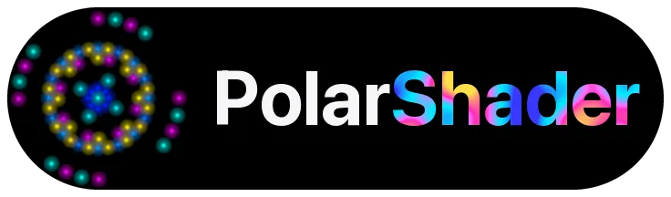

  

**A deterministic, fixed-point LED shader engine for microcontrollers — design in the browser, flash to your board.**

PolarShader turns a cheap microcontroller (Seeeduino XIAO SAMD21, XIAO RP2040, or Teensy 4.1) into a
real-time LED shader engine. You build animated effects for round, matrix, and phyllotaxis displays by
**stacking small transforms and signals** over a procedural pattern — the same way you'd layer nodes in
a shader graph — and it all runs in **fixed-point math with no floating point**, so animation stays
smooth and identical across boards and reboots.

## ▶ Try it live

**[Open the composer in your browser →](https://pthomain.github.io/PolarShader/composer/)** — no install,
nothing to build.

The hosted composer is for **designing, downloading, and loading** compositions in the browser. **Saving
to a playlist and flashing to a board require running the composer locally** via `web/serve.sh` (see
[Create & deploy locally](#-create--deploy-locally) below) — those actions talk to a local server that
the static GitHub Pages build doesn't provide.

## Why it's different

- **Fixed-point, deterministic** — no `float`/`double`; identical output across compilers, MCUs, and reboots.
- **Unified UV space** — every transform works on one normalized coordinate space, polar or matrix alike.
- **Composable transforms** — small, single-responsibility warps you can stack, reorder, and reuse.
- **Explicit, signal-driven motion** — animation comes from typed signals + integrators, never hidden state.
- **Dual-core-safe** — on RP2040, per-core sampler chains render in parallel from one prepared frame.

→ Full walkthrough in **[Core Concepts](docs/wiki/Core-Concepts.md)**.

## See it in action (assets pending)

GIFs are on the way. Placeholders — drop the clips into `docs/media/` (see
[docs/media/README.md](docs/media/README.md)) and these become live images:

<!-- composer UI GIF: docs/media/composer-ui.gif — editing patterns/transforms/signals live -->
<!-- round display GIF: docs/media/display-round.gif — a scene on the 241-pixel round display -->
<!-- matrix display GIF: docs/media/display-matrix.gif — a scene on a matrix display -->

## ⚡ Create & deploy locally

Running the composer locally unlocks saving compositions and flashing them to hardware.

1. **Install prerequisites** — Python 3, then `pip install -r web/requirements.txt`. PlatformIO is only
   needed for the deploy step.
2. **Start the composer** — `web/serve.sh` (rebuilds and serves on port `8000`), then open
   `http://localhost:8000/composer/`.
3. **Pick your display** — choose your layout from the dropdown, or add `?display=round` (etc.) to the URL.
4. **Compose a scene** — layer a pattern, transforms, and signals, then **Add to playlist** (writes a
   `.psc` file into `build/psc/` — local server only).
5. **Deploy** — select your board target and click **Deploy** to flash it (runs `pio run -e <env> -t upload`).

→ Details in **[Getting Started](docs/wiki/Getting-Started.md)** and
**[Deploying to Hardware](docs/wiki/Deploying-to-Hardware.md)**.

## Supported hardware

Each firmware target is one PlatformIO environment bound to a fixed display layout:

| env | Board | Display | Entry point |
|-----|-------|---------|-------------|
| `seeed_xiao` | Seeeduino XIAO (SAMD21) | Fabric (20×20) | `main_samd.cpp` |
| `seeed_xiao_rp2040_fabric` | Seeed XIAO RP2040 | Fabric (20×20) | `main_rp2040_fabric.cpp` |
| `seeed_xiao_rp2040_round` | Seeed XIAO RP2040 | Round (241 px) | `main_rp2040_round.cpp` |
| `seeed_xiao_rp2040_matrix32x8` | Seeed XIAO RP2040 | Fabric 32×8 | `main_rp2040_fabric32x8.cpp` |
| `seeed_xiao_rp2040_fibonacci` | Seeed XIAO RP2040 | Fibonacci (324 px) | `main_rp2040_fibonacci.cpp` |
| `teensy41_matrix` | Teensy 4.1 | SmartMatrix 128×128 | `main_teensy.cpp` |

→ More in **[Displays](docs/wiki/Displays.md)**.

## Documentation

- **[Getting Started](docs/wiki/Getting-Started.md)** — install, run the composer, build and save your first scene.
- **[Web Composer Guide](docs/wiki/Web-Composer-Guide.md)** — the UI in depth, playlists, embed mode, hosted vs local.
- **[Deploying to Hardware](docs/wiki/Deploying-to-Hardware.md)** — targets, the deploy flow, embedding playlists.
- **[Core Concepts](docs/wiki/Core-Concepts.md)** — Scene / Layer / Pattern / Transform / Signal and the design choices.
- **[Patterns](docs/wiki/Patterns.md)** · **[Transforms](docs/wiki/Transforms.md)** · **[Signals](docs/wiki/Signals.md)** · **[Displays](docs/wiki/Displays.md)** — reference catalogs.
- **[PSC Format](docs/psc-format.md)** — the binary scene format shared by the composer, WASM renderer, and firmware.

## License

GPL-3.0-or-later.
